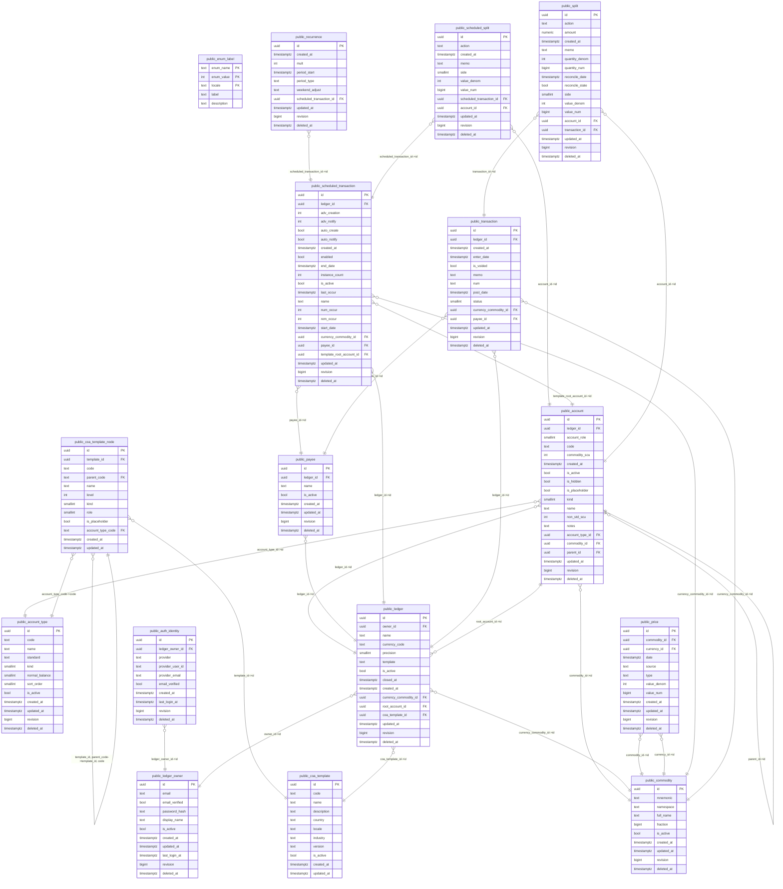

# ER Diagram (auto-generated)

```mermaid
erDiagram
  public_account {
     uuid id PK
     uuid ledger_id FK
     smallint account_role
     text code
     int commodity_scu
     timestamptz created_at
     bool is_active
     bool is_hidden
     bool is_placeholder
     smallint kind
     text name
     int non_std_scu
     text notes
     uuid account_type_id FK
     uuid commodity_id FK
     uuid parent_id FK
     timestamptz updated_at
     bigint revision
     timestamptz deleted_at
  }
  public_account_type {
     uuid id PK
     text code
     text name
     text standard
     smallint kind
     smallint normal_balance
     smallint sort_order
     bool is_active
     timestamptz created_at
     timestamptz updated_at
     bigint revision
     timestamptz deleted_at
  }
  public_auth_identity {
     uuid id PK
     uuid ledger_owner_id FK
     text provider
     text provider_user_id
     text provider_email
     bool email_verified
     timestamptz created_at
     timestamptz last_login_at
     bigint revision
     timestamptz deleted_at
  }
  public_coa_template {
     uuid id PK
     text code
     text name
     text description
     text country
     text locale
     text industry
     text version
     bool is_active
     timestamptz created_at
     timestamptz updated_at
  }
  public_coa_template_node {
     uuid id PK
     uuid template_id FK
     text code
     text parent_code FK
     text name
     int level
     smallint kind
     smallint role
     bool is_placeholder
     text account_type_code FK
     timestamptz created_at
     timestamptz updated_at
  }
  public_commodity {
     uuid id PK
     text mnemonic
     text namespace
     text full_name
     bigint fraction
     bool is_active
     timestamptz created_at
     timestamptz updated_at
     bigint revision
     timestamptz deleted_at
  }
  public_enum_label {
     text enum_name PK
     int enum_value PK
     text locale PK
     text label
     text description
  }
  public_ledger {
     uuid id PK
     uuid owner_id FK
     text name
     text currency_code
     smallint precision
     text template
     bool is_active
     timestamptz closed_at
     timestamptz created_at
     uuid currency_commodity_id FK
     uuid root_account_id FK
     uuid coa_template_id FK
     timestamptz updated_at
     bigint revision
     timestamptz deleted_at
  }
  public_ledger_owner {
     uuid id PK
     text email
     bool email_verified
     text password_hash
     text display_name
     bool is_active
     timestamptz created_at
     timestamptz updated_at
     timestamptz last_login_at
     bigint revision
     timestamptz deleted_at
  }
  public_payee {
     uuid id PK
     uuid ledger_id FK
     text name
     bool is_active
     timestamptz created_at
     timestamptz updated_at
     bigint revision
     timestamptz deleted_at
  }
  public_price {
     uuid id PK
     uuid commodity_id FK
     uuid currency_id FK
     timestamptz date
     text source
     text type
     int value_denom
     bigint value_num
     timestamptz created_at
     timestamptz updated_at
     bigint revision
     timestamptz deleted_at
  }
  public_recurrence {
     uuid id PK
     timestamptz created_at
     int mult
     timestamptz period_start
     text period_type
     text weekend_adjust
     uuid scheduled_transaction_id FK
     timestamptz updated_at
     bigint revision
     timestamptz deleted_at
  }
  public_scheduled_split {
     uuid id PK
     text action
     timestamptz created_at
     text memo
     smallint side
     int value_denom
     bigint value_num
     uuid scheduled_transaction_id FK
     uuid account_id FK
     timestamptz updated_at
     bigint revision
     timestamptz deleted_at
  }
  public_scheduled_transaction {
     uuid id PK
     uuid ledger_id FK
     int adv_creation
     int adv_notify
     bool auto_create
     bool auto_notify
     timestamptz created_at
     bool enabled
     timestamptz end_date
     int instance_count
     bool is_active
     timestamptz last_occur
     text name
     int num_occur
     int rem_occur
     timestamptz start_date
     uuid currency_commodity_id FK
     uuid payee_id FK
     uuid template_root_account_id FK
     timestamptz updated_at
     bigint revision
     timestamptz deleted_at
  }
  public_split {
     uuid id PK
     text action
     numeric amount
     timestamptz created_at
     text memo
     int quantity_denom
     bigint quantity_num
     timestamptz reconcile_date
     bool reconcile_state
     smallint side
     int value_denom
     bigint value_num
     uuid account_id FK
     uuid transaction_id FK
     timestamptz updated_at
     bigint revision
     timestamptz deleted_at
  }
  public_transaction {
     uuid id PK
     uuid ledger_id FK
     timestamptz created_at
     timestamptz enter_date
     bool is_voided
     text memo
     text num
     timestamptz post_date
     smallint status
     uuid currency_commodity_id FK
     uuid payee_id FK
     timestamptz updated_at
     bigint revision
     timestamptz deleted_at
  }
  public_account }o--|| public_account_type : "account_type_id->id"
  public_account }o--|| public_commodity : "commodity_id->id"
  public_account }o--|| public_ledger : "ledger_id->id"
  public_account }o--|| public_account : "parent_id->id"
  public_auth_identity }o--|| public_ledger_owner : "ledger_owner_id->id"
  public_coa_template_node }o--|| public_coa_template_node : "template_id, parent_code->template_id, code"
  public_coa_template_node }o--|| public_account_type : "account_type_code->code"
  public_coa_template_node }o--|| public_coa_template : "template_id->id"
  public_ledger }o--|| public_account : "root_account_id->id"
  public_ledger }o--|| public_coa_template : "coa_template_id->id"
  public_ledger }o--|| public_commodity : "currency_commodity_id->id"
  public_ledger }o--|| public_ledger_owner : "owner_id->id"
  public_payee }o--|| public_ledger : "ledger_id->id"
  public_price }o--|| public_commodity : "commodity_id->id"
  public_price }o--|| public_commodity : "currency_id->id"
  public_recurrence }o--|| public_scheduled_transaction : "scheduled_transaction_id->id"
  public_scheduled_split }o--|| public_account : "account_id->id"
  public_scheduled_split }o--|| public_scheduled_transaction : "scheduled_transaction_id->id"
  public_scheduled_transaction }o--|| public_commodity : "currency_commodity_id->id"
  public_scheduled_transaction }o--|| public_ledger : "ledger_id->id"
  public_scheduled_transaction }o--|| public_payee : "payee_id->id"
  public_scheduled_transaction }o--|| public_account : "template_root_account_id->id"
  public_split }o--|| public_account : "account_id->id"
  public_split }o--|| public_transaction : "transaction_id->id"
  public_transaction }o--|| public_commodity : "currency_commodity_id->id"
  public_transaction }o--|| public_ledger : "ledger_id->id"
  public_transaction }o--|| public_payee : "payee_id->id"
```
