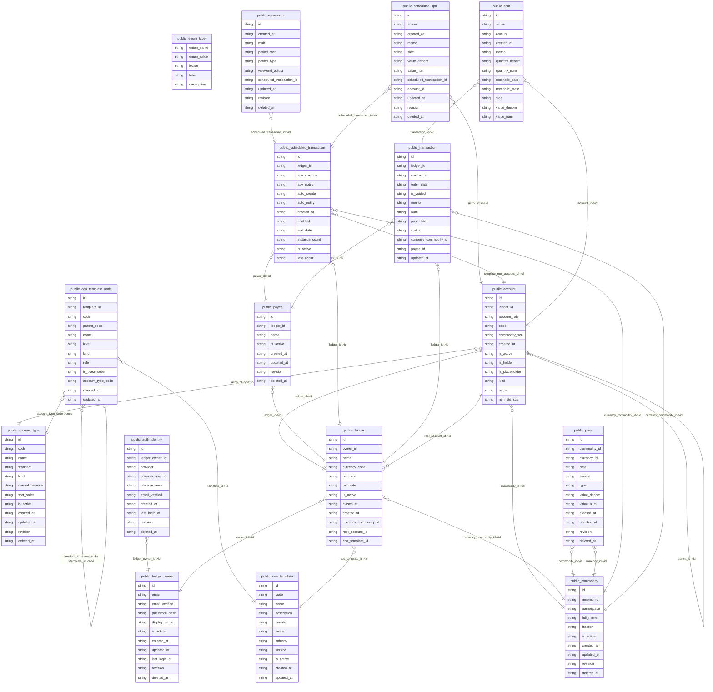

# ER Diagram (auto-generated)

```mermaid
erDiagram
  public_account {
     string id
     string ledger_id
     string account_role
     string code
     string commodity_scu
     string created_at
     string is_active
     string is_hidden
     string is_placeholder
     string kind
     string name
     string non_std_scu
  }
  public_account_type {
     string id
     string code
     string name
     string standard
     string kind
     string normal_balance
     string sort_order
     string is_active
     string created_at
     string updated_at
     string revision
     string deleted_at
  }
  public_auth_identity {
     string id
     string ledger_owner_id
     string provider
     string provider_user_id
     string provider_email
     string email_verified
     string created_at
     string last_login_at
     string revision
     string deleted_at
  }
  public_coa_template {
     string id
     string code
     string name
     string description
     string country
     string locale
     string industry
     string version
     string is_active
     string created_at
     string updated_at
  }
  public_coa_template_node {
     string id
     string template_id
     string code
     string parent_code
     string name
     string level
     string kind
     string role
     string is_placeholder
     string account_type_code
     string created_at
     string updated_at
  }
  public_commodity {
     string id
     string mnemonic
     string namespace
     string full_name
     string fraction
     string is_active
     string created_at
     string updated_at
     string revision
     string deleted_at
  }
  public_enum_label {
     string enum_name
     string enum_value
     string locale
     string label
     string description
  }
  public_ledger {
     string id
     string owner_id
     string name
     string currency_code
     string precision
     string template
     string is_active
     string closed_at
     string created_at
     string currency_commodity_id
     string root_account_id
     string coa_template_id
  }
  public_ledger_owner {
     string id
     string email
     string email_verified
     string password_hash
     string display_name
     string is_active
     string created_at
     string updated_at
     string last_login_at
     string revision
     string deleted_at
  }
  public_payee {
     string id
     string ledger_id
     string name
     string is_active
     string created_at
     string updated_at
     string revision
     string deleted_at
  }
  public_price {
     string id
     string commodity_id
     string currency_id
     string date
     string source
     string type
     string value_denom
     string value_num
     string created_at
     string updated_at
     string revision
     string deleted_at
  }
  public_recurrence {
     string id
     string created_at
     string mult
     string period_start
     string period_type
     string weekend_adjust
     string scheduled_transaction_id
     string updated_at
     string revision
     string deleted_at
  }
  public_scheduled_split {
     string id
     string action
     string created_at
     string memo
     string side
     string value_denom
     string value_num
     string scheduled_transaction_id
     string account_id
     string updated_at
     string revision
     string deleted_at
  }
  public_scheduled_transaction {
     string id
     string ledger_id
     string adv_creation
     string adv_notify
     string auto_create
     string auto_notify
     string created_at
     string enabled
     string end_date
     string instance_count
     string is_active
     string last_occur
  }
  public_split {
     string id
     string action
     string amount
     string created_at
     string memo
     string quantity_denom
     string quantity_num
     string reconcile_date
     string reconcile_state
     string side
     string value_denom
     string value_num
  }
  public_transaction {
     string id
     string ledger_id
     string created_at
     string enter_date
     string is_voided
     string memo
     string num
     string post_date
     string status
     string currency_commodity_id
     string payee_id
     string updated_at
  }
  public_account }o--|| public_account_type : "account_type_id->id"
  public_account }o--|| public_commodity : "commodity_id->id"
  public_account }o--|| public_ledger : "ledger_id->id"
  public_account }o--|| public_account : "parent_id->id"
  public_auth_identity }o--|| public_ledger_owner : "ledger_owner_id->id"
  public_coa_template_node }o--|| public_coa_template_node : "template_id, parent_code->template_id, code"
  public_coa_template_node }o--|| public_account_type : "account_type_code->code"
  public_coa_template_node }o--|| public_coa_template : "template_id->id"
  public_ledger }o--|| public_account : "root_account_id->id"
  public_ledger }o--|| public_coa_template : "coa_template_id->id"
  public_ledger }o--|| public_commodity : "currency_commodity_id->id"
  public_ledger }o--|| public_ledger_owner : "owner_id->id"
  public_payee }o--|| public_ledger : "ledger_id->id"
  public_price }o--|| public_commodity : "commodity_id->id"
  public_price }o--|| public_commodity : "currency_id->id"
  public_recurrence }o--|| public_scheduled_transaction : "scheduled_transaction_id->id"
  public_scheduled_split }o--|| public_account : "account_id->id"
  public_scheduled_split }o--|| public_scheduled_transaction : "scheduled_transaction_id->id"
  public_scheduled_transaction }o--|| public_commodity : "currency_commodity_id->id"
  public_scheduled_transaction }o--|| public_ledger : "ledger_id->id"
  public_scheduled_transaction }o--|| public_payee : "payee_id->id"
  public_scheduled_transaction }o--|| public_account : "template_root_account_id->id"
  public_split }o--|| public_account : "account_id->id"
  public_split }o--|| public_transaction : "transaction_id->id"
  public_transaction }o--|| public_commodity : "currency_commodity_id->id"
  public_transaction }o--|| public_ledger : "ledger_id->id"
  public_transaction }o--|| public_payee : "payee_id->id"
```