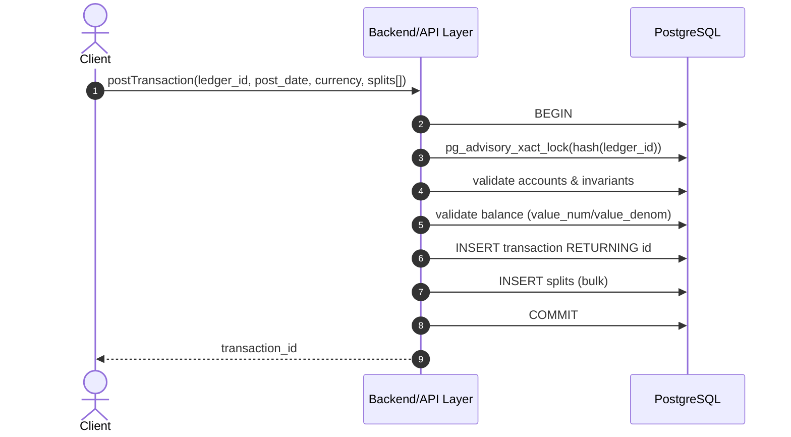

# Posting Engine – Sequence Diagram

```mermaid
sequenceDiagram
  autonumber
  actor Client
  participant API as Backend/API Layer
  participant DB as PostgreSQL

  Client->>API: postTransaction(ledger_id, post_date, currency, splits[])
  API->>DB: BEGIN
  API->>DB: pg_advisory_xact_lock(hash(ledger_id))
  API->>DB: validate accounts & invariants
  API->>DB: validate balance (value_num/value_denom)
  API->>DB: INSERT transaction RETURNING id
  API->>DB: INSERT splits (bulk)
  API->>DB: COMMIT
  API-->>Client: transaction_id
```
