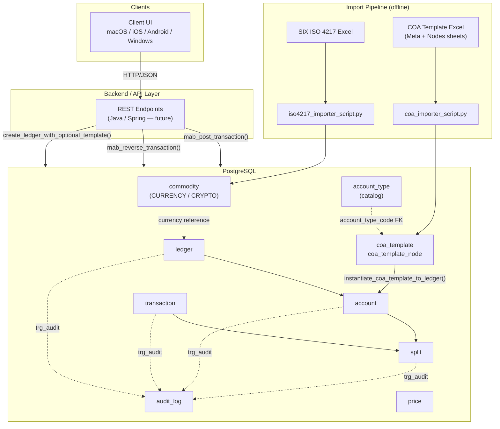
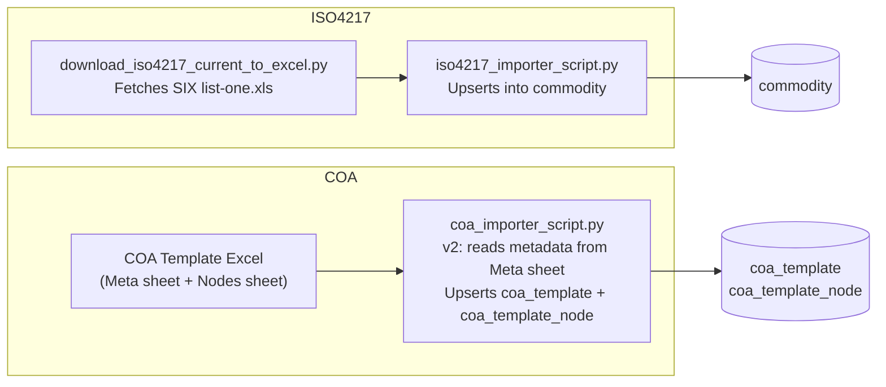
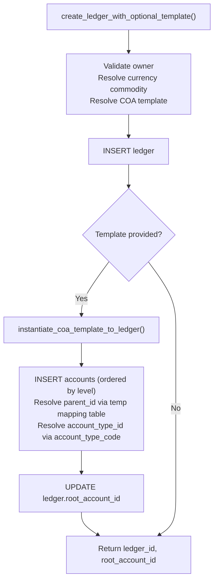

# Data Flow Diagram

```mermaid
flowchart TD
  subgraph Clients
    UI["Client UI\nmacOS / iOS / Android / Windows"]
  end

  subgraph Import["Import Pipeline (offline)"]
    XLS_ISO["SIX ISO 4217 Excel"]
    XLS_COA["COA Template Excel\n(Meta + Nodes sheets)"]
    PY_ISO["iso4217_importer_script.py"]
    PY_COA["coa_importer_script.py"]
  end

  subgraph API["Backend / API Layer"]
    REST["REST Endpoints\n(Java / Spring — future)"]
  end

  subgraph DB["PostgreSQL"]
    commodity["commodity\n(CURRENCY / CRYPTO)"]
    coa_template["coa_template\ncoa_template_node"]
    account_type["account_type\n(catalog)"]
    ledger["ledger"]
    account["account"]
    tx["transaction"]
    split["split"]
    audit["audit_log"]
    price["price"]
  end

  XLS_ISO --> PY_ISO --> commodity
  XLS_COA --> PY_COA --> coa_template
  account_type -.->|"account_type_code FK"| coa_template

  coa_template -->|"instantiate_coa_template_to_ledger()"| account
  commodity -->|currency reference| ledger
  ledger --> account
  account --> split
  tx --> split
  split -.->|"trg_audit"| audit
  tx -.->|"trg_audit"| audit
  ledger -.->|"trg_audit"| audit
  account -.->|"trg_audit"| audit

  UI -->|HTTP/JSON| REST
  REST -->|"mab_post_transaction()"| DB
  REST -->|"mab_reverse_transaction()"| DB
  REST -->|"create_ledger_with_optional_template()"| DB
```

---

## Import Pipeline Detail

```mermaid
flowchart LR
  subgraph ISO4217
    A["download_iso4217_current_to_excel.py\nFetches SIX list-one.xls"]
    B["iso4217_importer_script.py\nUpserts into commodity"]
    A --> B
  end

  subgraph COA
    C["COA Template Excel\n(Meta sheet + Nodes sheet)"]
    D["coa_importer_script.py\nv2: reads metadata from Meta sheet\nUpserts coa_template + coa_template_node"]
    C --> D
  end

  B --> commodity[(commodity)]
  D --> coa_template[(coa_template\ncoa_template_node)]
```

---

## Ledger Creation + Template Instantiation

```mermaid
flowchart TD
  A["create_ledger_with_optional_template()"]
  B["Validate owner\nResolve currency commodity\nResolve COA template"]
  C["INSERT ledger"]
  D{"Template provided?"}
  E["instantiate_coa_template_to_ledger()"]
  F["INSERT accounts (ordered by level)\nResolve parent_id via temp mapping table\nResolve account_type_id via account_type_code"]
  G["UPDATE ledger.root_account_id"]
  H["Return ledger_id, root_account_id"]

  A --> B --> C --> D
  D -- Yes --> E --> F --> G --> H
  D -- No --> H
```
