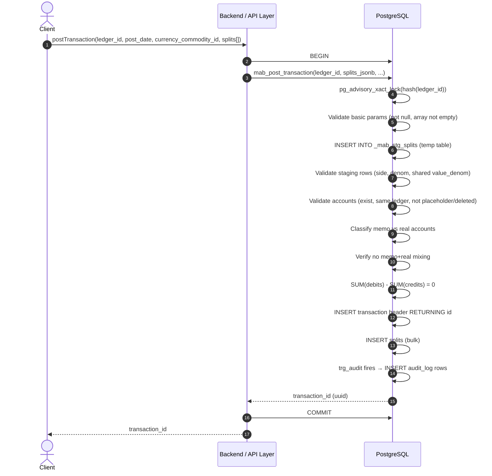
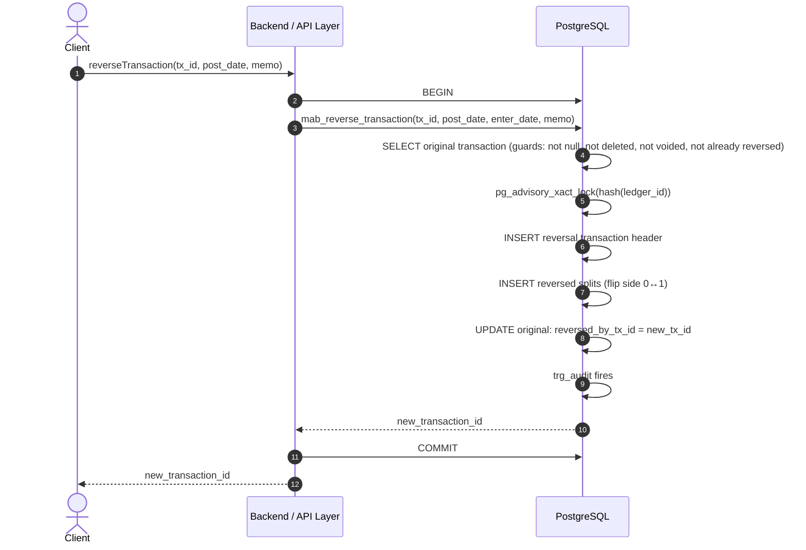
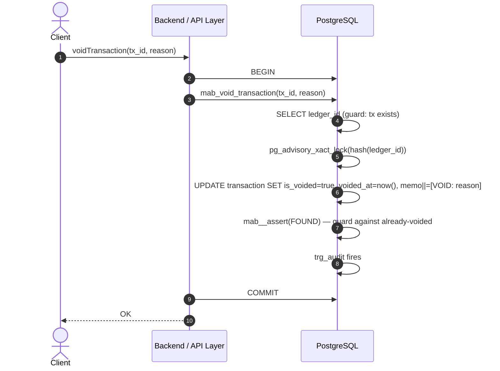
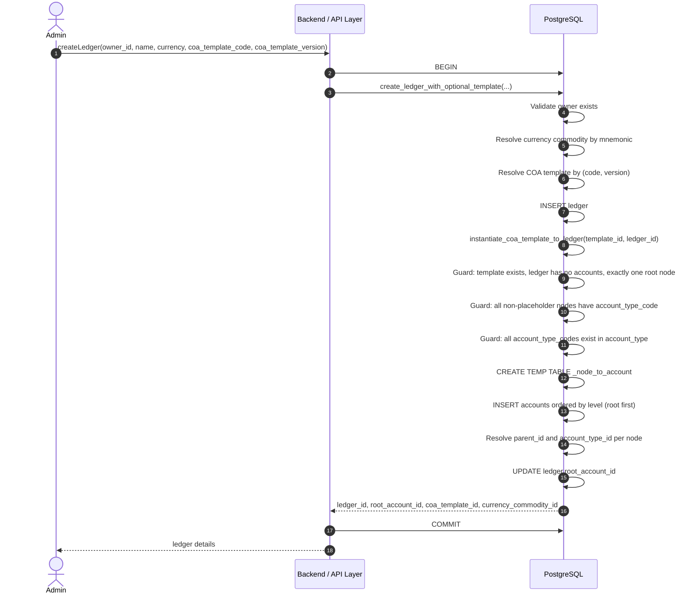

# Posting Engine — Sequence Diagrams

## Post Transaction

```mermaid
sequenceDiagram
  autonumber
  actor Client
  participant API as Backend / API Layer
  participant DB as PostgreSQL

  Client->>API: postTransaction(ledger_id, post_date, currency_commodity_id, splits[])
  API->>DB: BEGIN
  API->>DB: mab_post_transaction(ledger_id, splits_jsonb, ...)
  DB->>DB: pg_advisory_xact_lock(hash(ledger_id))
  DB->>DB: Validate basic params (not null, array not empty)
  DB->>DB: INSERT INTO _mab_stg_splits (temp table)
  DB->>DB: Validate staging rows (side, denom, shared value_denom)
  DB->>DB: Validate accounts (exist, same ledger, not placeholder/deleted)
  DB->>DB: Classify memo vs real accounts
  DB->>DB: Verify no memo+real mixing
  DB->>DB: SUM(debits) - SUM(credits) = 0
  DB->>DB: INSERT transaction header RETURNING id
  DB->>DB: INSERT splits (bulk)
  DB->>DB: trg_audit fires → INSERT audit_log rows
  DB-->>API: transaction_id (uuid)
  API->>DB: COMMIT
  API-->>Client: transaction_id
```

---

## Reverse Transaction

```mermaid
sequenceDiagram
  autonumber
  actor Client
  participant API as Backend / API Layer
  participant DB as PostgreSQL

  Client->>API: reverseTransaction(tx_id, post_date, memo)
  API->>DB: BEGIN
  API->>DB: mab_reverse_transaction(tx_id, post_date, enter_date, memo)
  DB->>DB: SELECT original transaction (guards: not null, not deleted, not voided, not already reversed)
  DB->>DB: pg_advisory_xact_lock(hash(ledger_id))
  DB->>DB: INSERT reversal transaction header
  DB->>DB: INSERT reversed splits (flip side 0↔1)
  DB->>DB: UPDATE original: reversed_by_tx_id = new_tx_id
  DB->>DB: trg_audit fires
  DB-->>API: new_transaction_id
  API->>DB: COMMIT
  API-->>Client: new_transaction_id
```

---

## Void Transaction

```mermaid
sequenceDiagram
  autonumber
  actor Client
  participant API as Backend / API Layer
  participant DB as PostgreSQL

  Client->>API: voidTransaction(tx_id, reason)
  API->>DB: BEGIN
  API->>DB: mab_void_transaction(tx_id, reason)
  DB->>DB: SELECT ledger_id (guard: tx exists)
  DB->>DB: pg_advisory_xact_lock(hash(ledger_id))
  DB->>DB: UPDATE transaction SET is_voided=true, voided_at=now(), memo||=[VOID: reason]
  DB->>DB: mab__assert(FOUND) — guard against already-voided
  DB->>DB: trg_audit fires
  API->>DB: COMMIT
  API-->>Client: OK
```

---

## Template Instantiation

```mermaid
sequenceDiagram
  autonumber
  actor Admin
  participant API as Backend / API Layer
  participant DB as PostgreSQL

  Admin->>API: createLedger(owner_id, name, currency, coa_template_code, coa_template_version)
  API->>DB: BEGIN
  API->>DB: create_ledger_with_optional_template(...)
  DB->>DB: Validate owner exists
  DB->>DB: Resolve currency commodity by mnemonic
  DB->>DB: Resolve COA template by (code, version)
  DB->>DB: INSERT ledger
  DB->>DB: instantiate_coa_template_to_ledger(template_id, ledger_id)
  DB->>DB: Guard: template exists, ledger has no accounts, exactly one root node
  DB->>DB: Guard: all non-placeholder nodes have account_type_code
  DB->>DB: Guard: all account_type_codes exist in account_type
  DB->>DB: CREATE TEMP TABLE _node_to_account
  DB->>DB: INSERT accounts ordered by level (root first)
  DB->>DB: Resolve parent_id and account_type_id per node
  DB->>DB: UPDATE ledger.root_account_id
  DB-->>API: ledger_id, root_account_id, coa_template_id, currency_commodity_id
  API->>DB: COMMIT
  API-->>Admin: ledger details
```
